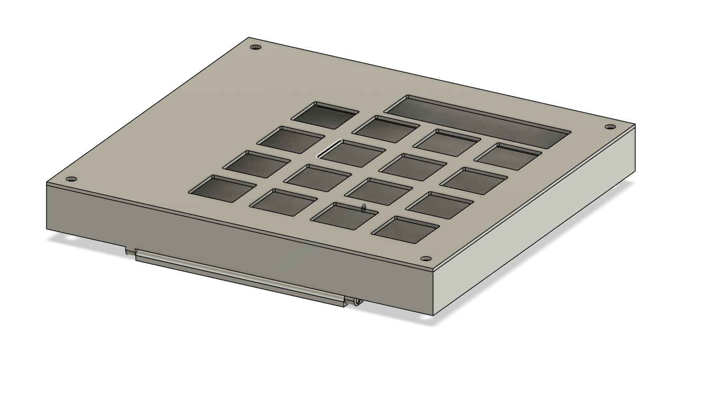

# newmacropad
This is my first macropad and my first time making a custom pcb. This macropad case comes with a stand so you can use it sort of like a stream deck. 

The case has a stand at the bottom, making the angle adjustable. 

# BOM
4x Cherry MX Switches
4x any Keycap
4x M3x5x4 Heatset inserts
4x M3x16mm SHCS Bolts
16x 1N4148 DO-35 Diodes.
1x 0.91" 128x32 OLED Display
1x XIAO RP2040
1x Case (2 prints, 1 of them have 3 print in place parts)
